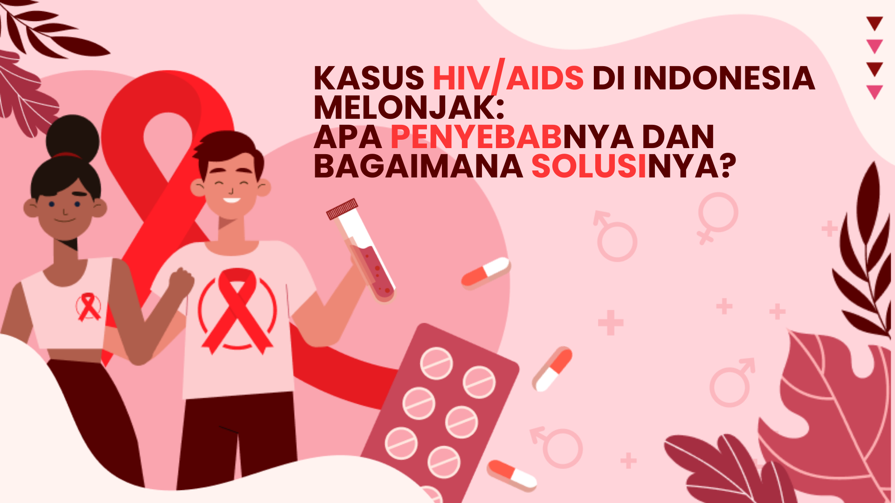
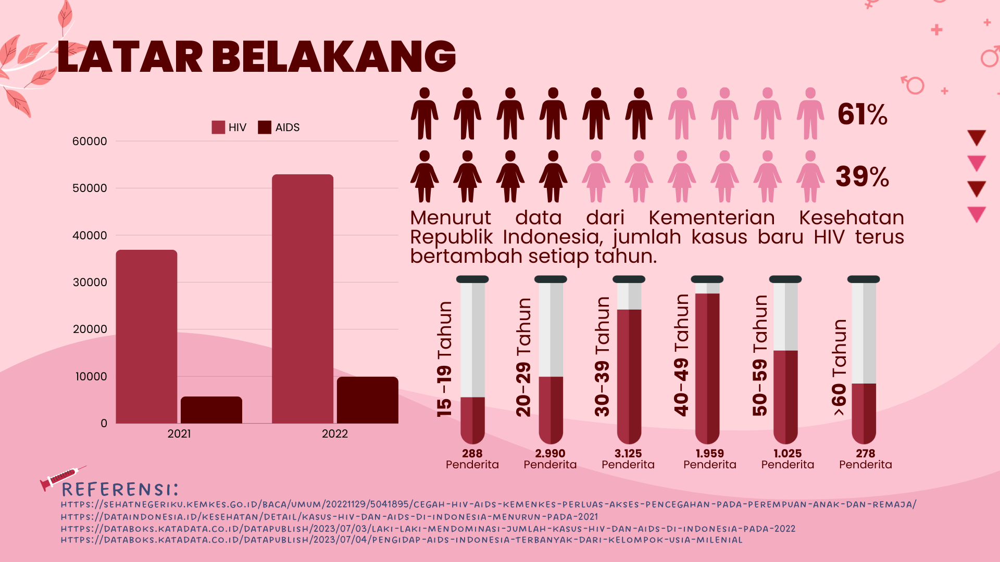
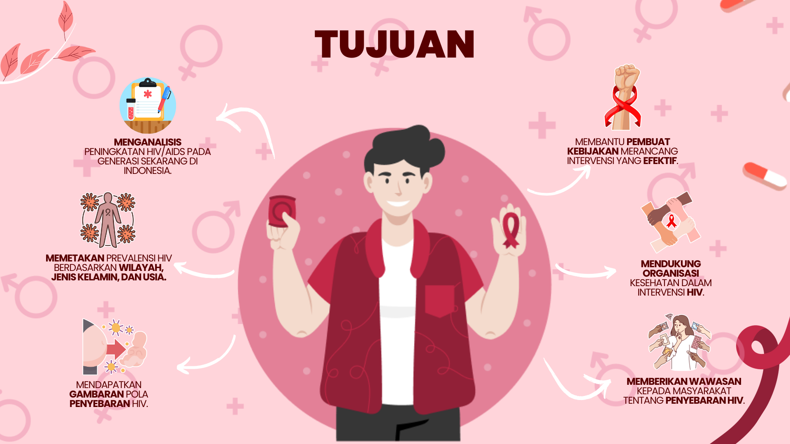
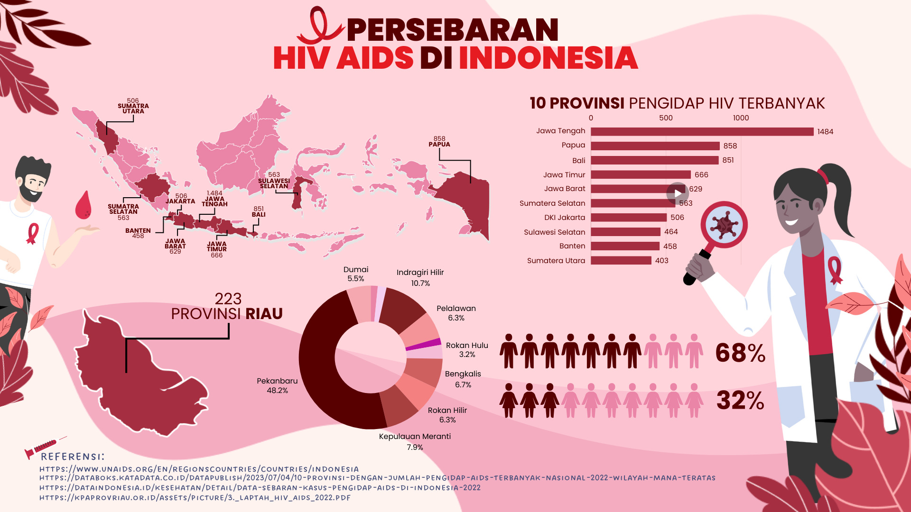
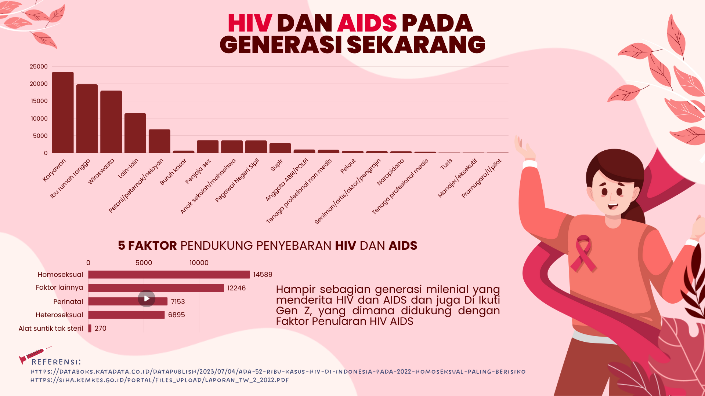

# Kasus HIV/AIDS di Indonesia: Penyebab dan Solusinya

## Pendahuluan

Proyek ini berfokus pada analisis peningkatan kasus HIV/AIDS di Indonesia, dengan tujuan memberikan wawasan dan rekomendasi untuk intervensi yang lebih efektif. Data yang digunakan dalam proyek ini diperoleh dari berbagai sumber terpercaya seperti Kementerian Kesehatan Republik Indonesia dan UNAIDS.

## Anggota Kelompok

- Muhammad As-Shaff
- Bintang Puspita Dewi
- Afri Hakim

## Latar Belakang

Menurut data dari Kementerian Kesehatan Republik Indonesia, jumlah kasus baru HIV terus bertambah setiap tahun. Kasus HIV/AIDS ini berdampak pada berbagai kelompok usia, dengan prevalensi yang tinggi pada kelompok usia muda.

## Tujuan

Proyek ini bertujuan untuk:
1. Menganalisis peningkatan HIV/AIDS pada generasi sekarang di Indonesia.
2. Membantu pembuat kebijakan merancang intervensi yang efektif.
3. Mendukung organisasi kesehatan dalam intervensi HIV.
4. Memberikan wawasan kepada masyarakat tentang penyebaran HIV.
5. Memetakan prevalensi HIV berdasarkan wilayah, jenis kelamin, dan usia.
6. Mendapatkan gambaran pola penyebaran HIV.

## Data dan Sumber

Data yang digunakan dalam proyek ini diambil dari:
- [Kementerian Kesehatan Republik Indonesia](https://sehatnegeriku.kemkes.go.id/baca/umum/20221129/5041895/cegah-hiv-aids-kemenkes-perluas-akses-pencegahan-pada-perempuan-anak-dan-remaja/) - Sumber ini menyediakan informasi tentang upaya pemerintah Indonesia dalam memperluas akses pencegahan HIV/AIDS, terutama untuk perempuan, anak, dan remaja.
- [Data Indonesia](https://dataindonesia.id/kesehatan/detail/kasus-hiv-dan-aids-di-indonesia-menurun-pada-2021) - Sumber ini memberikan data statistik tentang penurunan jumlah kasus HIV dan AIDS di Indonesia pada tahun 2021.
- [Katadata](https://databoks.katadata.co.id/datapublish/2023/07/03/laki-laki-mendominasi-jumlah-kasus-hiv-dan-aids-di-indonesia-pada-2022) - Sumber ini memberikan informasi tentang dominasi jumlah kasus HIV dan AIDS di Indonesia berdasarkan jenis kelamin pada tahun 2022.
- [UNAIDS](https://www.unaids.org/en/regionscountries/countries/indonesia) - UNAIDS menyediakan data dan analisis global tentang situasi HIV/AIDS di Indonesia.
- [BPS](https://www.bps.go.id/id/statistics-table/2/MTM4OSMy/prevalensi-hiv-pada-populasi-dewasa--15-49-tahun-.html) - Badan Pusat Statistik Indonesia menyediakan data prevalensi HIV pada populasi dewasa berusia 15-49 tahun dari tahun 2016-2017.
- [Katadata](https://databoks.katadata.co.id/datapublish/2023/07/04/ada-52-ribu-kasus-hiv-di-indonesia-pada-2022-homoseksual-paling-berisiko) - Sumber ini mengidentifikasi faktor risiko tertinggi dalam penyebaran HIV di Indonesia pada tahun 2022.
- [Katadata](https://databoks.katadata.co.id/datapublish/2023/07/04/pengidap-aids-indonesia-terbanyak-dari-kelompok-usia-milenial) - Sumber ini menguraikan jumlah kasus AIDS di Indonesia berdasarkan kelompok usia pada tahun 2022.
- [Katadata](https://databoks.katadata.co.id/datapublish/2023/07/04/10-provinsi-dengan-jumlah-pengidap-aids-terbanyak-nasional-2022-wilayah-mana-teratas) - Sumber ini mencantumkan 10 provinsi dengan jumlah kasus AIDS terbanyak di Indonesia pada tahun 2022.
- [Katadata](https://databoks.katadata.co.id/datapublish/2023/07/03/laki-laki-mendominasi-jumlah-kasus-hiv-dan-aids-di-indonesia-pada-2022) - Sumber ini menyoroti dominasi kasus HIV dan AIDS di Indonesia berdasarkan jenis kelamin pada tahun 2022.
- [Katadata](https://databoks.katadata.co.id/datapublish/2022/08/29/ratusan-mahasiswa-bandung-positif-hiv-bagaimana-perkembangan-kasus-hiv-dan-aids-di-ri) - Sumber ini menyediakan data tentang jumlah kasus HIV positif di kalangan mahasiswa di Indonesia dari tahun 2011-2021.
- [Data Indonesia](https://dataindonesia.id/kesehatan/detail/kasus-hiv-dan-aids-di-indonesia-menurun-pada-2021) - Sumber ini memberikan data statistik tentang penurunan jumlah kasus HIV dan AIDS di Indonesia pada tahun 2021.
- [Kumparan](https://kumparan.com/kumparannews/data-sebaran-kasus-hiv-di-ri-per-juni-2022-jakarta-nyaris-100-000-jatim-kedua-1ylaPA3kcjw/full/gallery/2) - Sumber ini memberikan informasi tentang sebaran kasus HIV di Indonesia per Juni 2022.
- [Kemenkes Laporan 2022](https://siha.kemkes.go.id/portal/files_upload/Laporan_TW_2_2022.pdf) - Laporan triwulan kedua tahun 2022 dari Kementerian Kesehatan Indonesia yang memuat data dan analisis tentang kasus HIV/AIDS di Indonesia.
- [Kemenkes Laporan 2021](https://siha.kemkes.go.id/portal/files_upload/Laporan_TW_I_2021_FINAL.pdf) - Laporan triwulan pertama tahun 2021 dari Kementerian Kesehatan Indonesia yang memuat data dan analisis tentang kasus HIV/AIDS di Indonesia.
- [Data Indonesia](https://dataindonesia.id/kesehatan/detail/data-sebaran-kasus-pengidap-aids-di-indonesia-2022) - Sumber ini menyediakan data sebaran kasus AIDS di Indonesia pada tahun 2022.
- [KPA Riau](https://kpaprovriau.or.id/assets/picture/3._LAPTAH_HIV_AIDS_2022.pdf) - Laporan tahunan program HIV/AIDS dan IMS Provinsi Riau tahun 2022.

## Analisis

### Prevalensi Kasus Berdasarkan Usia

| Usia       | Jumlah Penderita |
|------------|------------------|
| 15-19 tahun| 288              |
| 20-29 tahun| 2.990            |
| 30-39 tahun| 3.125            |
| 40-49 tahun| 1.959            |
| 50-59 tahun| 1.025            |
| >60 tahun  | 278              |

### Persebaran Kasus Berdasarkan Wilayah

| Provinsi           | Jumlah Kasus |
|--------------------|--------------|
| Jawa Tengah        | 1.484        |
| Papua              | 858          |
| Bali               | 851          |
| Jawa Timur         | 666          |
| Jawa Barat         | 629          |
| Sumatera Selatan   | 563          |
| DKI Jakarta        | 506          |
| Sulawesi Selatan   | 464          |
| Banten             | 458          |
| Sumatera Utara     | 403          |

### Faktor Penularan

| Faktor Penularan      | Jumlah Kasus |
|-----------------------|--------------|
| Homoseksual           | 14.589       |
| Perinatal             | 7.153        |
| Heteroseksual         | 6.895        |
| Alat suntik tak steril| 270          |
| Faktor lainnya        | 12.246       |

## Audiens yang Dituju

- Mahasiswa
- Pekerja
- Ibu Rumah Tangga

## Layout Infografis

Proyek ini juga menyediakan berbagai infografis yang memvisualisasikan data-data tersebut untuk memudahkan pemahaman dan penyebaran informasi kepada masyarakat.

## Terima Kasih

Terima kasih atas perhatian dan partisipasinya dalam proyek ini. Semoga informasi yang disajikan dapat bermanfaat dan membantu dalam upaya pencegahan dan penanggulangan HIV/AIDS di Indonesia.
